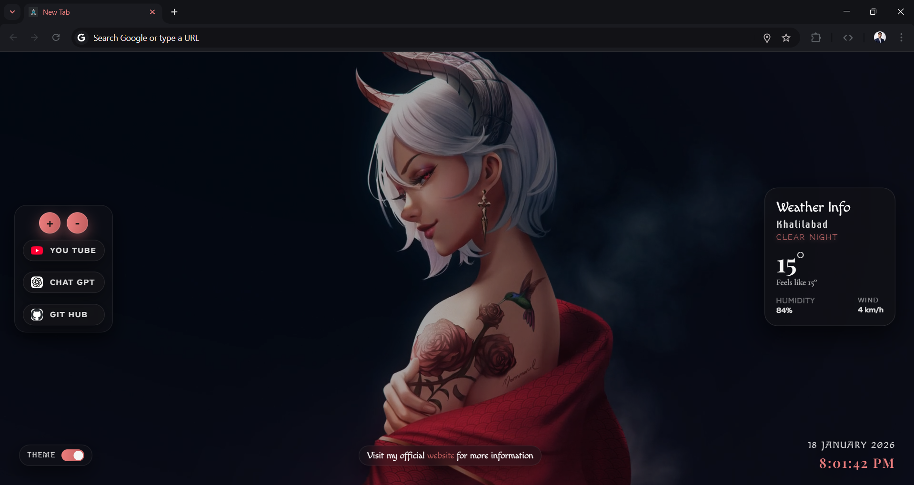

# Anima – Anime-Themed Chrome New Tab Extension

**Anima** is a modern, anime-inspired Chrome extension that replaces the default New Tab with a cinematic experience.  
It combines animated backgrounds, live weather, quick links, and a custom Chrome theme for anime lovers.

---

## Features

- **Animated Video Background** (MP4)
- **Live Weather** (location-based, free API)
- **Real-Time Clock & Date**
- **Custom Quick Links**
- Add / remove links
- Auto favicon detection
- **Built-in Chrome Theme**
- Dark anime aesthetic
- Crimson accent colors
- **Local Storage Powered**
- **Manifest V3 Compliant**

---

## Project Structure

```bash
Anima/
│
├── extension/
│ ├── assets/
│ │ ├── background.mp4
│ │ ├── background.png
│ │ ├── icon.png
│ │ └── default-icon.svg
│ │
│ ├── popup.html
│ ├── popup.js
│ │
│ ├── newtab.html
│ ├── newtab.js
│ ├── style.css
│ │
│ ├── background.js
│ └── manifest.json
│
├── theme/
│ ├── manifest.json
│ ├── assets/
│ │ ├── theme_background.png
│ │ └── icon.png
│
└── README.md
```

---

## Extension vs Theme

### Extension (`/extension`)

- Overrides Chrome New Tab
- Displays:
  - Background video
  - Weather widget
  - Clock & date
  - Quick links
- Uses `chrome.storage.local`
- Built with **Manifest V3**

### 🔹 Theme (`/theme`)

- Applies Chrome UI styling:
  - Tab bar
  - Toolbar
  - Omnibox
- Independent Chrome Theme
- Can be installed separately

---

## Weather Data

- **Provider:** Open-Meteo (Weather)
- **Reverse Geocoding:** BigDataCloud
- **No API key required**
- **Location-based**
- *Privacy-friendly (no tracking)*

---

## Installation (Developer Mode)

1. Clone the repository:

```bash
   git clone https://github.com/webdevavi96/Anima.git

```

2. Open Chrome and go to:

```bash
chrome://extensions
```

3. Enable Developer mode (top-right)

4. Click Load unpacked

    - Select the /extension folder

5. (Optional) Load the theme for better experience:

    - Go to Extensions → Themes

    - Load the /theme folder

## Permissions Used

**storage** – save user links & preferences

**activeTab** – extension UI interaction

**geolocation** – weather location

**host_permissions** – weather APIs

*No ads. No tracking. No analytics.*

## Tech Stack

- HTML5 / CSS3
- Vanilla JavaScript
- Chrome Extensions API (MV3)
- Open-Meteo API
- BigDataCloud Reverse Geocoding

## Author

Avinash Chaurasiya
[Git Hub](https://github.com/webdevavi96/)

## Support

- If you like this project:

- Star the repo

- Share it with fellow anime lovers

- Contribute via PRs

## Screenshot



Watch demo video 👇
[](https://res.cloudinary.com/meplay/video/upload/AnimaVideo_qiudnw.mp4)

